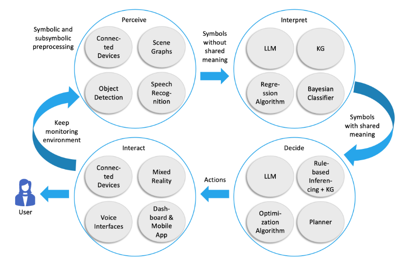
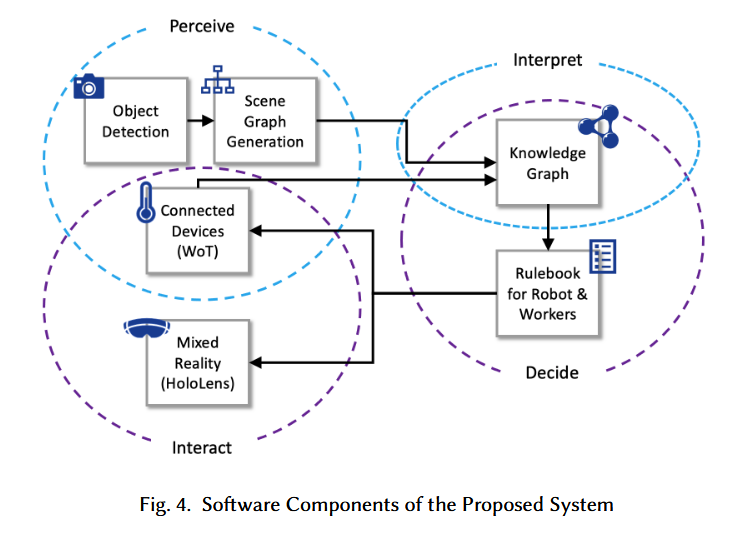

论文发表于2024年5月15日

*Proceedings of the ACM on Interactive, Mobile, Wearable and Ubiquitous Technologies, Volume 8, Issue 2. Article No. 66, Pages 1 - 26.* [https://doi.org/10.1145/3659610](https://doi.org/10.1145/3659610)

# 论文作者

Kimberly Garcia, University of St.Gallen, Switzerland

Jonathan Vontobel, University of St.Gallen, Switzerland

Simon Mayer, University of St.Gallen, Switzerland

# 摘要翻译

Ambient Intelligence (AmI) focuses on creating environments capable of proactively and transparently adapting to users and their activities. Traditionally, AmI focused on the availability of computational devices, the pervasiveness of networked environments, and means to interact with users. In this paper, we propose a renewed AmI architecture that takes into account current technological advancements while focusing on proactive adaptation for assisting and protecting users. This architecture consist of four phases: Perceive, Interpret, Decide, and Interact. The AmI systems we propose, called Digital Companions (DC), can be embodied in a variety of ways (e.g., through physical robots or virtual agents) and are structured according to these phases to assist and protect their users. We further categorize DCs into Expert DCs and Personal DCs, and show that this induces a favorable separation of concerns in AmI systems, where user concerns (including personal user data and preferences) are handled by Personal DCs and environment concerns (including interfacing with environmental artifacts) are assigned to Expert DCs; this separation has favorable privacy implications as well. Herein, we introduce this architecture and validate it through a prototype in an industrial scenario where robots and humans collaborate to perform a task.

环境智能（Ambient Intelligence, AmI）主要关注如何创建一个能够主动且透明地适应用户及其活动的环境，传统的AmI关注计算设备的可用性、网络环境的普遍性和用户交互的方式。在本文中，我们提出了一种新型AmI架构，其采用目前最新的科技进展并同时聚焦于主动适应性，用于辅助和保护用户，该架构包括四个阶段：感知、分析、决策和互动。我们提出的AmI——数字伴侣（Digital Companion, DC），其能够通过多种方式进行集成（例如物理机器人或者虚拟代理软件），并以上面提到的四个阶段为架构来辅助和保护用户。我们进一步将DC分为专家型DC和个人型DC，这种分类在AmI系统中能够对不同问题进行有效分离，个人用户数据和偏好由个人型DC处理，环境设施接口等环境交互问题由专家型DC处理，这样的分离也能够对隐私方面产生有利的影响。本文将介绍该架构，其在工业场景中验证了机器人与人类协作执行任务的应用原型有效性。

## 短评

感觉摘要结构上有一定问题，这篇文章到底希望解决哪个问题？这个问题之前的方案的缺点？自己的新模型的优点是主动适应性？架构的四个阶段也是传统的OODA循环。

# 笔记

## 引言

> Later on, Cook et al. [17] specified further the term sensible by analysing the common characteristics of the research in the field, concluding that the AmI community was set to create physical spaces that are sensitive, responsive, adaptive, transparent, ubiquitous, and intelligent.

> [17] Diane J. Cook, Juan C. Augusto, and Vikramaditya R. Jakkula. 2009. Ambient intelligence: Technologies, applications, and opportunities. Pervasive and Mobile Computing 5, 4 (2009), 277–298. [https://doi.org/10.1016/j.pmcj.2009.04.001](https://doi.org/10.1016/j.pmcj.2009.04.001)

AmI环境的关键词：敏感、响应式、自适应、透明、泛在、智能。目前的Siri、Alexa可以说是一些AmI的商业化尝试，其能够实现生活辅助以及搭建自动化程序流程。

我记得很早之前的IFTTT就在尝试着将不同的应用程序打通，当时的iOS还不具有自动化程序的功能，最近几年的iPhoneOS以及iPadOS均支持用户设置一系列的跨应用自动化流程指令，并且能够通过Siri/Homepod进行非常自然的启动和激活。

华为最近也提出了智能体交互的概念（2024年6月底的CCF操作系统研讨会），所以说计算机的交互模式从最早的打孔机、到苹果鼠标输入、微软Windows的窗口UI交互、iPhone触摸交互，我认为未来会继续向自然语言交互、手势交互、脑机交互等多模态方向发展（GPT4o）。

> On this basis, Dunne et al. proposes an updated definition of AmI: technologies that combine the Internet of Things (IoT) and Artificial Intelligence (AI) to create adaptive environments.

Dunne给出了对AmI的另一个定义，即结合物联网和人工智能创造的自适应环境。

## 相关工作

1. Companion Systems Architectures
    
    Recogniton+Knowledge+Planing,Reasoning,Decision+Interaction

2. Intelligent Assistants Architectures

    > ... is to create human-centered applications designed to assist users capable of observing, understanding, learning, and acting. To achieve this, an architecture with three components is proposed, namely Observe, Understand, and Act.

3. Companion Robots Architectures

    > Romeo2 [44] is a companion for everyday life. It relies on a sensing-interaction-perception architecture composed by five layers, namely Sense, Cognize, Recognize, Track, and Interact.

## 论文提出的新型AmI架构

该架构的知识库采用Semantic Web（Web 3.0），其Perceive主要由传感器完成：

> Information from connected devices can be obtained using IoT protocols (e.g., MQTT and the Constrained Application Protocol—CoAP), and higher-level technologies such as the Web of Things [33], which proposes the creation of uniform descriptions of the programming interface of connected devices through the usage of W3C WoT Thing Descriptions (TD)

Intepret环境则是对Perceive的数据进行上下文拓展（Shared Meaning），例如在服务器机房读取到50度的环境温度，那么这个阶段会继续拓展——50度是高温还是低温？相对服务器机房呢？

> Some of the algorithms capable of achieving this broader contextualization can be categorized as symbolic or sub-symbolic AI[40].

symbolic AI: Knowledge Graph
sub-symbolic AI: LLM

Decide阶段DC会计算应当执行的行为，利用LLM将Intepret的Shared Meaning映射到行为。

> In this phase, a DC computes timely and pertinent proactive and reactive actions to take in an AmI environment, for assisting or protecting a user. We define a proactive action as one that is taken in anticipation of a user need.

> For a DC to decide on an action to take based on the output of the Interpret phase, it needs knowledge about the possible states in an AmI environment, and how to reach them. To reach a state, several variables might need to be changed (e.g., cooling a room might require starting the air conditioning unit, closing the windows, and constantly monitoring the temperature to keep it stable); this change might be achieved by actuating a connected device, or by using a virtual service (e.g, initiating an algorithm to forecast energy consumption of a building). To reach those states in an AmI environment, we consider symbolic and sub-symbolic AI approaches capable of understanding the shared meaning that the inputs from the Interpret phase have been enriched with.

Interact阶段则是将最终计算好的行为传递给用户（如使用传统手机交互或MR设备/声音接口等），或者直接主动操作设备（如调整房间亮度控制器等）。

# 总结

论文给出了基于OODA循环的一种环境智能实现的框架和原型，通过Hololens与用户进行交互，除了交互接口的TTS/STT、在对采集的数据的分析解读、行为的推测中，sub-symbolic的LLM也许在整个循环中能够发挥作用（文章应该是用的传统KG）。不过如果需要用LLM的话，模型训练和部署对硬件的要求均不低。

# 词汇

siloization - (management, informatics) The splitting of personnel, data, etc. into isolated units with poor communication. 机井化，即组织被严格限制在其界限以内,对其他组织的权限一无所知