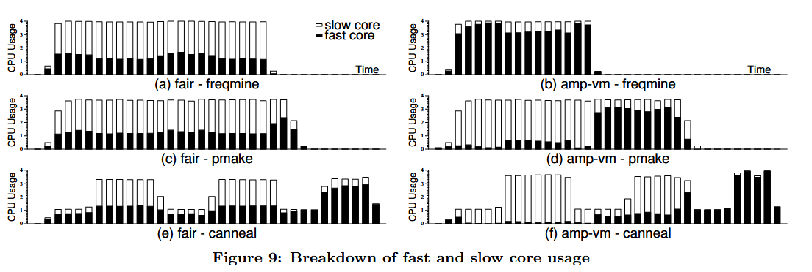

论文发表于2011年6月4日

*ISCA '11: Proceedings of the 38th annual international symposium on Computer architecture.June 2011.Pages 45 - 56.* [https://doi.org/10.1145/2000064.2000071](https://doi.org/10.1145/2000064.2000071)

# 论文作者

Youngjin Kwon, Changdae Kim, Seungryoul Maeng, and Jaehyuk Huh

Computer Science Department, KAIST

{yjkwon and cdkim}@calab.kaist.ac.kr, {maeng and jhhuh}@kaist.ac.kr

# 摘要翻译

Performance-asymmetric multi-cores consist of heterogeneous cores, which support the same ISA, but have different computing capabilities. To maximize the throughput of asymmetric multi-core systems, operating systems are responsible for scheduling threads to different types of cores. However, system virtualization poses a challenge for such asymmetric multi-cores, since virtualization hides the physical heterogeneity from guest operating systems. In this paper, we explore the design space of hypervisor schedulers for asymmetric multi-cores, which do not require asymmetry-awareness from guest operating systems. The proposed scheduler characterizes the efficiency of each virtual core, and map the virtual core to the most area-efficient physical core. In addition to the overall system throughput, we consider two important aspects of virtualizing asymmetric multi-cores: performance fairness among virtual machines and performance scalability for changing availability of fast and slow cores.
We have implemented an asymmetry-aware scheduler in the open-source Xen hypervisor. Using applications with various characteristics, we evaluate how effectively the proposed scheduler can improve system throughput without asymmetry-aware operating systems. The modified scheduler improves the performance of the Xen credit scheduler by as much as 40% on a 12-core system with four fast and eight slow cores. The results show that even the VMs scheduled to slow cores have relatively low performance degradations, and the scheduler provides scalable performance with increasing fast core counts.

性能不对称多核系统由异构核心组成，这些核心支持相同的指令集架构（ISA），但具有不同的计算能力。为了最大化不对称多核系统的吞吐量，操作系统负责将线程调度到不同类型的核心。然而，系统虚拟化对这种不对称多核系统提出了挑战，因为虚拟化会将物理异构性隐藏起来，使得客户操作系统无法感知。在本文中，我们探讨了不需要客户操作系统具备异构性意识的虚拟机管理程序（hypervisor）调度器的设计空间。我们提出的调度器通过评估每个虚拟核心的效率，将其映射到最具区域效率的物理核心上。除了系统整体吞吐量之外，我们还考虑了虚拟化不对称多核系统的两个重要方面：虚拟机之间的性能公平性和快速与慢速核心可用性变化的性能可扩展性。

我们在开源的Xen虚拟机管理程序中实现了一个异构性感知调度器。通过使用具有不同特性的应用程序，我们评估了该调度器在无需客户操作系统具备异构性意识的情况下，提升系统吞吐量的效果。修改后的调度器在一个包含四个快速核心和八个慢速核心的12核系统上，能够将Xen Credit调度器的性能提升多达40%。结果显示，即使被调度到慢速核心的虚拟机也仅有相对较低的性能下降，并且该调度器在增加快速核心数量时，能够提供可扩展的性能。

# 笔记

> Virtualization poses a challenge to use heterogeneous cores efficiently. It hides the physical asymmetry of cores, and guest operating systems may schedule threads as if they are using homogeneous cores.

虚拟化由于使用了vCPU进行抽象，虚拟机反而无法得到真正物理CPU的相关信息了（如ARM的大小核性能和功耗不同，但抽象为vCPU后虚拟机就感知不到这样的区别了，因为vCPU可以被调度到任何pCPU上运行，此处不考虑Static Partition式Hypervisor），在云计算的场景下这样的问题非常普遍，因为大部分云服务商都是使用虚拟机对客户提供服务的。如何解决？论文的思路是从Hypervisor的调度这里下手。

> To truly virtualize physical resources, the hypervisor must hide the physical asymmetry of underlying cores, and create an illusion of symmetric cores for virtual machines. Guest OSes must be able to use virtual resources without knowing the physical constraints. Active asymmetry-aware hypervisors should find the best mapping between virtual and physical cores to maximize the throughput of a given asymmetric multi-core system.

论文背景中给出了一种Active asymmetry-aware结构，即不让虚拟机OS处理大小核调度，而是全部抽象为对称CPU，然后在Hypervisor中选择最合适的pCPU给vCPU运行。相反，Passive asymmetry-aware结构则是将所有大小核信息交给虚拟机去选择，但是这样需要修改虚拟机OS源码来获取当前机器上其他虚拟机的信息。

> In this paper, we explore the design space of active asymmetryaware hypervisor schedulers. The proposed scheduler characterizes the behavior of each virtual core without any input from guest OSes or applications. It maps virtual cores to physical cores to maximize the throughput of asymmetric cores, with only the information collected online at the hypervisor.

论文给出了Active asymmetry-aware的设计，虚拟机不需要得到异构信息，而Hypervisor会在运行时动态收集信息并调度vCPU。

论文给出的fast core efficiency预测公式：

$$\text{fast core efficiency score}=\text{IPC} \times \text{utilization}$$

论文在Active asymmetry-aware的结构上，修改了Xen的Credit算法并根据运行时对大小核的效率评估以及对各个虚拟机的fairness的保证（amp-R%-fair调度）。

> amp-R%-fair scheduler evenly distributes R% of fast core cycles to all virtual CPUs, and assigns the rest of fast core cycles to vCPUs with high fast core efficiency scores.

canneal等测试来自PARSEC Benchmark Suite 3.0（[https://github.com/bamos/parsec-benchmark](https://github.com/bamos/parsec-benchmark)），主要用于并行计算性能测试，论文实现的新调度算法和完全多核公平（忽略大小核）的amp-fair进行对比。

Performance结果：

> The performance results indicate that an active asymmetryaware hypervisor can trace the fast core efficiencies of VMs only by monitoring performance counters for each VM or vCPU. Without any support from guest OSes, the hypervisor can achieve the potential performance improvement from a given asymmetric multi-core processor.

Fairness结果：

> The amp-vm and amp-vcpu policies assign fast cores to high efficiency VMs, not considering any fairness among VMs. Even with such unfair policies, the performance degradation against the fair scheduler is relatively low for two reasons. Firstly, virtual machines scheduled to slow cores have low efficiencies anyway. Therefore, even if the fair scheduler allocates some share of fast core cycles to the low efficiency VMs, the performance gain is low. Secondly, even low efficiency VMs use some fast core cycles during the execution because some virtual CPUs of the high efficiency VMs often may not be ready for execution.

Scalability结果：

> The fair scheduler and two asymmetry-aware schedulers provide much better scalability than the credit scheduler and the pinned configuration. The three schedulers with high scalability maintain two rules in scheduling vCPUs to asymmetric cores. Firstly, the fast cores never become idle when the slow cores have active vCPUs to run. Secondly, each vCPU in the same VM gets an equal share of fast core cycles. By allocating fast and slow cores evenly for vCPUs in the same VM, even if a thread in a slow core lags behind other threads, the thread will be able to catch up when it receives some share of fast core cycles later.

# 总结

在不修改虚拟机OS的情况下，让虚拟机不去感知异构信息，而是提供一个假“对称”的虚拟机CPU结构，在Hypervisor中监控和采样每个虚拟机的“得分”并将其vCPU分配到合适的大小核上运行：

> To estimate IPC and utilization, the hypervisor monitors hardware performance counters, and measures the retired instructions and processor cycles during a time interval for each virtual CPU. Based on the measurement, the scheduler periodically updates scheduling decisions.

是一个很有意思的思路，实验的结果也比较合理，能够让大核在虚拟机的环境中物尽其用。

# 词汇

monopolize - (of an organization or group) obtain exclusive possession or control of (a trade, commodity, or service).

vCPU overcommitment - Overcommitting CPU resources for VMs means allocating more virtual CPUs (vCPUs) to the virtual machines (VMs) than the physical cores.