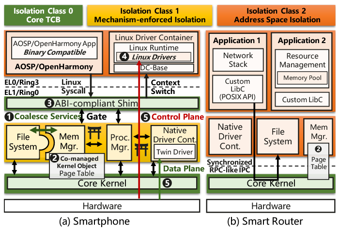

# 论文作者

*the Proceedings of the 18th USENIX Symposium on Operating Systems Design and Implementation.*

[https://www.usenix.org/conference/osdi24/presentation/chen-haibo](https://www.usenix.org/conference/osdi24/presentation/chen-haibo)

Haibo Chen, Xie Miao, Ning Jia, Nan Wang, Yu Li, Nian Liu, Yutao Liu, Fei Wang, Qiang Huang, Kun Li, Hongyang Yang, Hui Wang, Jie Yin, Yu Peng, and Fengwei Xu

Huawei Central Software Institute, Shanghai Jiao Tong University

# 摘要翻译

The virtues of security, reliability, and extensibility have made state-of-the-art microkernels prevalent in embedded and safety-critical scenarios. However, they face performance and compatibility issues when targeting more general scenarios, such as smartphones and smart vehicles.

This paper presents the design and implementation of HongMeng kernel (HM), a commercialized general-purpose microkernel that preserves most of the virtues of microkernels while addressing the above challenges. For the sake of commercial practicality, we design HM to be compatible with the Linux API and ABI to reuse its rich applications and driver ecosystems. To make it performant despite the constraints of compatibility and being general-purpose, we re-examine the traditional microkernel wisdom, including IPC, capability-based access control, and userspace paging, and retrofit them accordingly. Specifically, we argue that per-invocation IPC is not the only concern for performance, but IPC frequency, state double bookkeeping among OS services, and capabilities that hide kernel objects contribute to significant performance degradation. We mitigate them accordingly with a set of techniques, including differentiated isolation classes, flexible composition, policy-free kernel paging, and address-token-based access control.

HM consists of a minimal core kernel and a set of least-privileged OS services, and it can run complex frameworks like AOSP and OpenHarmony. HM has been deployed in production on tens of millions of devices in emerging scenarios, including smart routers, smart vehicles and smartphones, typically with improved performance and security over their Linux counterparts.

微内核因其安全性、可靠性和可扩展性在嵌入式和安全关键场景中广受欢迎。然而，当应用于更通用的场景如智能手机和智能汽车时，它们面临着性能和兼容性问题。

本文介绍了鸿蒙内核（HM）的设计和实现，这是一款商业化的通用微内核，旨在保留微内核大部分优点的同时，解决上述挑战。为了实现商业实用性，我们设计了HM兼容Linux API和ABI，以重用其丰富的应用程序和驱动程序生态系统。为了在兼容性和通用性的限制下仍保持高性能，我们重新审视了传统的微内核理念，包括进程间通信（IPC）、基于能力的访问控制以及用户空间分页，并对其进行相应改造。具体而言，我们认为每次调用的IPC不是性能的唯一问题，IPC频率、操作系统服务间的状态双重记录以及隐藏内核对象的能力也会导致显著的性能下降。我们通过一系列技术来缓解这些问题，包括差异化隔离类、灵活的组合、无策略内核分页和基于地址令牌的访问控制。

HM由一个最小的核心内核和一组最低特权的操作系统服务组成，可以运行复杂的框架如AOSP和OpenHarmony。HM已经在包括智能路由器、智能汽车和智能手机在内的数千万设备中投入生产，并且通常在性能和安全性方面优于其Linux同行。

## 短评

之前一直分不太清这几个“鸿蒙”，查了一下资料，看起来HarmonyOS 4之后的版本目前是多内核的，包括传统Android生态的Linux内核以及仅开发者可用的Open Harmony内核，而HarmonyOS 4 NEXT看起来则是要完全抛弃Linux这一部分而只支持Open Harmony了。说到Open Harmony，从其官网上的架构图中可用看出其能够支持不同的底层内核（Linux、LiteOS等），Open Harmony实际上是在外面包装了更多服务的一个框架，然后整体再为HarmonyOS提供支持。

而本论文中的HM内核则更像是一个微内核的尝试，其能够支持Linux的接口并使用Linux的软件生态，放在Open Harmony结构里则是将其内核抽象层之下的Linux换成了“假Linux（外部看起来全部是Linux的ABI和API）”的HM内核。

## 笔记

论文首先给出了几个Observation：

> Observation 1: IPC frequency increases rapidly in emerging scenarios. Figure 1a shows the IPC frequency CDF in HM when configuring all OS services to be isolated in userspace. Smartphones (avg. 41k/s) and vehicles (7k/s) have a much higher IPC frequency than routers (0.6k/s, more similar to domain-specific scenarios).

> Observation 2: Distributed multi-server causes state double bookkeeping.

> Observation 3: Capabilities inhibit efficient cooperation.

> Observation 4: Eco-compatibility requires more than POSIX compliance.

> Observation 5: Deployment in emerging scenarios requires efficient driver reuse.

比较核心的图，鸿蒙内核架构：

相比与传统微内核，鸿蒙内核在设计的各个方面均进行了进一步拓展，包括优化隔离策略（不使用传统的微内核用户空间服务隔离，而是差异化策略），并且在分页管理、POSIX兼容方面进一步拓展，而实现Linux兼容的接口又使其能够很方便地复用Linux生态（系统软件、用户软件、驱动程序）。几个突出特点：

1. 同步的RPC（Remote Procedure Call）地址分配
2. 设置不同的隔离等级/分离（Isolation Class），CL0（传统内核态）、CL2（传统用户态）、CL1（增强的“用户态”）
3. 访问管理使用Address Tokens实现内核object的协同管理
4. 丰富的POSIX支持，以及对Linux接口下软件生态的兼容

# 总结

从实验结果来看，HM鸿蒙微内核在智能终端（手机、路由器、车机等）上的表现能够优于Linux，并且由于支持了完整的Linux接口，其又可以兼容Linux生态（主要利用其驱动），鸿蒙内核在传统微内核的基础上添加了很多新的设计，在一定程度上解决了微内核的部分效率问题，又能够保持微内核轻量级的特点。

# 词汇

inhibit - 抑制