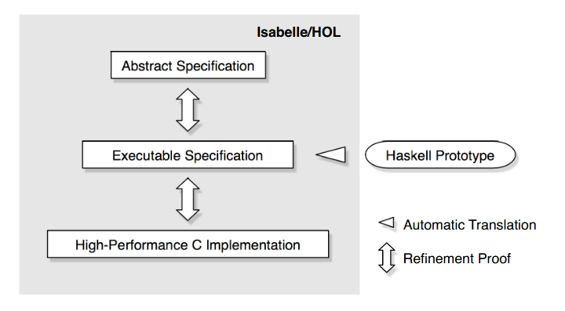

*SOSP '09: Proceedings of the ACM SIGOPS 22nd symposium on Operating systems principles.October 2009.Pages 207 - 220.* [https://doi.org/10.1145/1629575.1629596](https://doi.org/10.1145/1629575.1629596)

# 论文作者

Gerwin Klein, Kevin Elphinstone, Gernot Heiser, June Andronick, David Cock, Philip Derrin, Dhammika Elkaduwe, Kai Engelhardt, Rafal Kolanski, Michael Norrish, Thomas Sewell, Harvey Tuch, and Simon Winwood

NICTA, UNSW, Open Kernel Labs, ANU, ertos@nicta.com.au

# 摘要翻译

Complete formal verification is the only known way to guarantee that a system is free of programming errors.

We present our experience in performing the formal, machine-checked verification of the seL4 microkernel from an abstract specification down to its C implementation. We assume correctness of compiler, assembly code, and hardware, and we used a unique design approach that fuses formal and operating systems techniques. To our knowledge, this is the first formal proof of functional correctness of a complete, general-purpose operating-system kernel. Functional correctness means here that the implementation always strictly follows our high-level abstract specification of kernel behaviour. This encompasses traditional design and implementation safety properties such as the kernel will never crash, and it will never perform an unsafe operation. It also proves much more: we can predict precisely how the kernel will behave in every possible situation.

seL4, a third-generation microkernel of L4 provenance, comprises 8,700 lines of C code and 600 lines of assembler. Its performance is comparable to other high-performance L4 kernels.

完全形式化验证是唯一已知的能够保证系统没有编程错误的方法。

我们在此展示了从抽象规范到C实现的seL4微内核的形式化、机器检查验证的经验。我们假设编译器、汇编代码和硬件的正确性，并使用了一种融合了形式化和操作系统技术的独特设计方法。据我们所知，这是第一次对完整的、通用的操作系统内核进行功能正确性的形式证明。这里的功能正确性是指实现始终严格遵循我们对内核行为的高级抽象规范。这包括传统的设计和实现安全属性，例如内核永远不会崩溃，并且不会执行不安全的操作。它还证明了更多：我们可以准确预测内核在每种可能情况下的行为。

seL4是一个源于L4的第三代微内核，包括8700行C代码和600行汇编代码。其性能可与其他高性能L4内核媲美。

# 笔记

论文给出的sel4微内核的几个重要特点：

1. 虚拟地址空间内没有内核相关的结构
2. 缺页异常通过IPC被传递到pager相关线程完成（处理虚拟地址映射）
3. 异常与非原生系统调用（Non-native Syscall，例如wsl中虚拟机的fork需要转换为Windows系统调用）也通过IPC传递以支持虚拟化
4. 设备驱动运行在user-mode

论文中对sel4的形式化验证采用了[Isabelle/HOL](https://isabelle.in.tum.de/)，sel4在形式化验证方面的特点：

> 1. 其行为在抽象层次上有精确的形式化规范；
> 2. 通过形式化设计证明了终止性和执行安全等理想属性；
> 3. 其实现经过形式化证明符合规范；
> 4. 其访问控制机制经过形式化证明，提供强有力的安全保证。

**refinement**

> 形式化验证中的**refinement（精化）**是指在开发软件或硬件系统时，通过一系列严格定义的步骤，从一个抽象的、高层次的规范逐步转化为更具体、实现层次更低的描述。每一步转化都必须保持与上一层次的一致性，以确保最终实现的系统符合最初的规范。



例如下面是一段最顶层的抽象层Isabelle/HOL代码

```
schedule ≡ do
  threads ← all_active_tcbs
  thread ← select threads
  switch_to_thread thread
od OR switch_to_idle_thread
```

然后是下一层可执行的规范（Haskell代码）：

```haskell
schedule = do
  action <- getSchedulerAction
  case action of
    ChooseNewThread -> do
      chooseThread
      setSchedulerAction
    ResumeCurrentThread -> ...
      
chooseThread = do
  r <- findM chooseThread' (reverse [minBound .. maxBound])
  when (r == Nothing) $ switchToIdleThread

chooseThread' prio = do
  q <- getQueue prio
  liftM isJust $ findM chooseThread'' q

chooseThread'' thread = do
  runnable <- isRunnable thread
  if not runnable
    then do
      tcbSchedDequeue thread
      return False
    else do
      switchToThread thread
      return True
```

最终转换来的C代码（部分）：

```c
void setPriority(tcb_t *tptr, prio_t prio) {
    prio_t oldprio;
    if (thread_state_get_tcbQueued(tptr->tcbState)) {
        oldprio = tptr->tcbPriority;
        ksReadyQueues[oldprio] = tcbSchedDequeue(tptr, ksReadyQueues[oldprio]);
        if (isRunnable(tptr)) {
            ksReadyQueues[prio] = tcbSchedEnqueue(tptr, ksReadyQueues[prio]);
        } else {
            thread_state_ptr_set_tcbQueued(&tptr->tcbState, false);
        }
    }
    tptr->tcbPriority = prio;
}
```

# 总结

seL4目前支持arm-v6和x86架构，其根据形式化方法对内核设计进行了新的考虑：

> We observed a confluence of design principles from the formal methods and the OS side, leading to design decisions such as an event-based kernel that is mostly non-preemptable and uses interrupt polling.

如基于事件的内核实现（大部分情况下不进行抢占并采用中断轮询法），其目的是尽可能使得内核能够被形式化验证。

https://www.pm.inf.ethz.ch/research/viper.html

https://www.pm.inf.ethz.ch/research/prusti.html

Key Publications

V. Astrauskas, A. Bílý, J. Fiala, Z. Grannan, C. Matheja, P. Müller, F. Poli, and A. J. Summers: The Prusti Project: Formal Verification for Rust (invited).
NASA Formal Methods (14th International Symposium), 2022.

F. Wolff, A. Bílý, C. Matheja, P. Müller, and A. J. Summers: Modular Specification and Verification of Closures in Rust.
Object-Oriented Programming Systems, Languages, and Applications (OOPSLA), 2021

V. Astrauskas, C. Matheja, P. Müller, F. Poli, and A. J. Summers: How Do Programmers Use Unsafe Rust?
Object-Oriented Programming Systems, Languages, and Applications (OOPSLA), 2020.

V. Astrauskas and P. Müller and F. Poli and A. J. Summers: Leveraging Rust Types for Modular Specification and Verification.
Object-Oriented Programming Systems, Languages, and Applications (OOPSLA), 2019.

V. Astrauskas and P. Müller and F. Poli and A. J. Summers, Leveraging Rust Types for Modular Specification and Verification.
Technical Report, ETH Research Collection, 2019.

# 词汇

paramount - 首要的