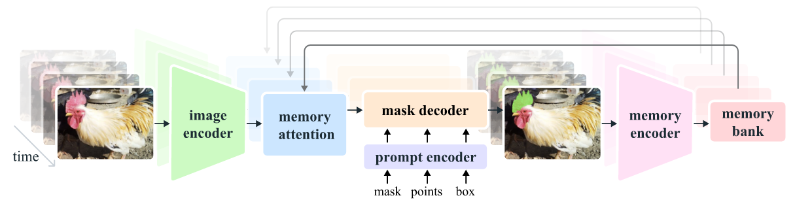
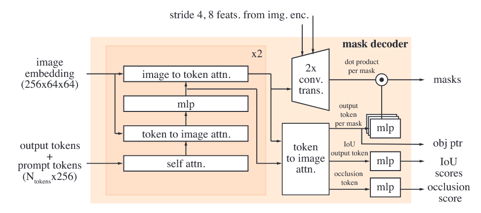

# 论文作者

Nikhila Ravi, Valentin Gabeur, Yuan-Ting Hu, Ronghang Hu, Chaitanya Ryali, Tengyu Ma, Haitham Khedr, Roman Rädle, Chloe Rolland, Laura Gustafson, Eric Mintun, Junting Pan, Kalyan Vasudev Alwala, Nicolas Carion, Chao-Yuan Wu, Ross Girshick, Piotr Dollár, Christoph Feichtenhofer.

Meta FAIR

Demo: [https://sam2.metademolab.com](https://sam2.metademolab.com)

Code: [https://github.com/facebookresearch/segment-anything-2](https://github.com/facebookresearch/segment-anything-2)

Website: [https://ai.meta.com/sam2](https://ai.meta.com/sam2)

# 摘要翻译

We present Segment Anything Model 2 (SAM 2), a foundation model towards solving promptable visual segmentation in images and videos. We build a data engine, which improves model and data via user interaction, to collect the largest video segmentation dataset to date. Our model is a simple transformer architecture with streaming memory for real-time video processing. SAM 2 trained on our data provides strong performance across a wide range of tasks. In video segmentation, we observe better accuracy, using 3x fewer interactions than prior approaches. In image segmentation, our model is more accurate and 6x faster than the Segment Anything Model (SAM). We believe that our data, model, and insights will serve as a significant milestone for video segmentation and related perception tasks. We are releasing a version of our model, the dataset and an interactive demo.

我们提出了 Segment Anything Model 2 (SAM 2)，这是一种用于解决图像和视频中可提示视觉分割的基础模型。我们构建了一个数据引擎，通过用户交互来改进模型和数据，以收集迄今为止最大的视频分割数据集。我们的模型是一个简单的变压器架构，具有流式记忆功能，可用于实时视频处理。在我们数据上训练的 SAM 2 在广泛的任务中表现出色。在视频分割中，我们观察到使用比以前的方法少三倍的交互次数即可获得更高的准确性。在图像分割中，我们的模型比之前的 Segment Anything Model (SAM) 更准确且速度快六倍。我们相信，我们的数据、模型和见解将成为视频分割和相关感知任务的重要里程碑。我们将发布我们的模型版本、数据集和一个交互式演示。

# 笔记

三个核心点：

1. **Task**: Promptable Visual Segmentation
2. **Model**: Segment Anything Model 2
3. **Data**: Data Engine and Dataset - Segment Anything Video (SA-V) dataset

> We focus on the **Promptable Visual Segmentation (PVS)** task that generalizes image segmentation to the video domain. The task takes as input points, boxes, or masks on any frame of the video to define a segment of interest for which the spatio-temporal mask (i.e., a **‘masklet’**) is to be predicted. Once a masklet is predicted, it can be iteratively refined by providing prompts in additional frames.

PVS 任务允许在视频的任意帧上为模型提供提示。提示可以是正/负点击、边界框或掩码，用于定义要分割的对象或优化模型预测的对象。为了提供交互式体验，当在特定帧上收到提示时，模型应立即返回该帧上对象的有效分割掩码。

> Our **streaming architecture** is a natural generalization of SAM to the video domain, processing video frames one at a time, equipped with a memory attention module to attend to the previous memories of the target object.

SAM2的结构：

**Image encoder**

> We use an MAE (He et al., 2022) pre-trained Hiera (Ryali et al., 2023; Bolya et al., 2023) image encoder, which is hierarchical, allowing us to use multiscale features during decoding.

图像编码器在实时视频处理中用于将每一帧转换为紧凑的特征嵌入，这些特征表示了帧中的重要信息（如颜色、纹理、对象等），并在整个视频中保持一致。使用预训练的分层编码器（如 MAE 预训练的 Hiera）可以有效提取多尺度特征，提高处理效率和模型的泛化能力，从而在识别和跟踪不同大小和距离的目标时更准确。

**Memory attention**

记忆注意力的作用是根据过去帧的特征和预测以及任何新的提示来调整当前帧的特征。我们堆叠了 $L$ 个 Transformer 块，第一个块以当前帧的图像编码作为输入。每个块先进行自注意力操作，然后进行交叉注意力，处理存储在记忆库中的（提示/非提示）帧和对象指针的记忆。最后，经过多层感知器（MLP）处理。我们使用普通的注意力操作来实现自注意力和交叉注意力，从而可以利用最新的高效注意力计算方法的发展。

在使用正弦绝对位置嵌入（sinusoidal absolute positional embeddings）的基础上，该模型在自注意力（self-attention）和交叉注意力（cross-attention）层中使用了二维空间旋转位置嵌入（2D spatial Rotary Positional Embedding, RoPE）。对象指针标记（object pointer tokens）不包含在 RoPE 中，因为它们没有特定的空间对应关系。默认情况下，记忆注意力使用 $L=4$ 层。

**Prompt encoder and mask decoder**

我们的提示编码器与 SAM 的相同，可以通过点击（正负）、边界框或掩码进行提示，以定义给定帧中对象的范围。稀疏提示通过位置编码和针对每种提示类型学习的嵌入相加来表示，而掩码则通过卷积进行嵌入，并与帧的嵌入相加。这种设计允许灵活地通过多种提示类型调整和精细化对象识别，从而提高模型在不同场景下的准确性和适应性。

**Memory encoder**

记忆编码器通过使用卷积模块对输出掩码进行下采样来生成记忆，并将其与来自图像编码器的不加条件的帧嵌入逐元素相加。接下来，通过轻量级卷积层融合这些信息。这一过程有助于将掩码信息与原始帧特征结合，创建一种增强的记忆表示，从而提高在后续步骤中对目标的跟踪和识别能力。

**Memory bank**

记忆库通过维护一个先进先出（FIFO）队列，保存目标对象在视频中的过去预测信息，其中包含最近最多 $N$ 帧的记忆，并在另一个 FIFO 队列中存储来自提示的帧信息，最多可达 $M$ 帧。例如，在视频目标分割（VOS）任务中，初始掩码是唯一的提示，记忆库会始终保留第一帧的记忆以及最多 $N$ 个最近（未提示）帧的记忆。这些记忆都存储为空间特征图，有助于模型在处理视频时更好地跟踪和识别目标对象。