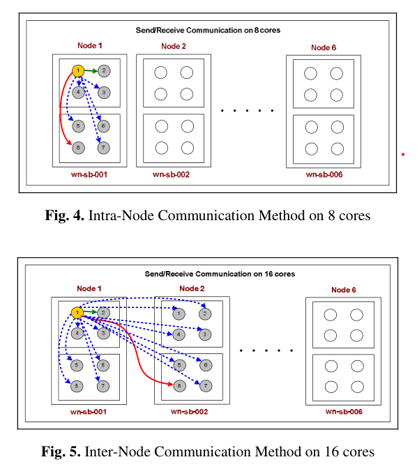

https://dl.acm.org/doi/10.1145/3577193.3593720

Authors: Nicholas Contini, Bharath Ramesh, Kaushik Kandadi Suresh, Tu Tran, Ben Michalowicz, Mustafa Abduljabbar, Hari Subramoni, Dhabaleswar Panda

**ICS '23: Proceedings of the 37th International Conference on Supercomputing**

ICS ’23, June 21–23, 2023, Orlando, FL, USA

Pages 477 - 487

https://doi.org/10.1145/3577193.3593720

## 摘要翻译

Modern HPC faces new challenges with the slowing of Moore's Law and the end of Dennard Scaling. Traditional computing architectures can no longer be expected to drive today's HPC loads, as shown by the adoption of heterogeneous system design leveraging accelerators such as GPUs and TPUs. Recently, FPGAs have become viable candidates as HPC accelerators. These devices can accelerate workloads by replicating implemented compute units to enable task parallelism, overlapping computation between and within kernels to enable pipeline parallelism, and increasing data locality by sending data directly between compute units. While many solutions for inter-FPGA communication have been presented, these proposed designs generally rely on inter-FPGA networks, unique system setups, and/or the consumption of soft logic resources on the chip. 

In this paper, we propose an FPGA-aware MPI runtime that avoids such shortcomings. Our MPI implementation does not use any special system setup other than plugging FPGA accelerators into PCIe slots. All communication is orchestrated by the host, utilizing the PCIe interconnect and inter-host network to implement message passing. We propose advanced designs that address data movement challenges and reduce the need for explicit data movement between the device and host (staging) in FPGA applications. We achieve up to 50% reduction in latency for point-to-point transfers compared to application-level staging.

现代高性能计算（HPC）面临一些新挑战，其来源于摩尔定律的放缓以及登纳德缩放定律的结束。传统计算架构不再能够驱动今天的高性能计算负载，其往往使用GPU、TPU等加速器构成的异构系统设计。最近，FPGA已经成为HPC的一个可行的加速器，这些设备能够采用复制计算单元的方法实现任务并行，以加速工作负载执行，在kernel之间和内部覆盖计算来实现流水线并行，并通过将数据在计算单元间直接发送的方法提升数据局部性。目前已经有很多跨FPGA通信方案被提出，这些设计总体来说依赖跨FPGA的网络、独特的系统搭建、以及对片上软逻辑资源的消耗。

在本文中，我们提出了一种FPGA感知的MPI运行时来避免上面的问题。我们的MPI实现不需要任何特殊的系统搭建，**仅仅需要将FPGA插入PCIe槽即可**。所有通讯由主机协调，充分利用PCIe互联以及主机间网络来实现消息传递。我们提出了创新性的设计，解决数据移动的相关挑战，并减少FPGA应用中的设备和主机之间的显式数据移动。在点对点传输中，相比于应用级别的实现，我们实现了50%的延迟优化。

## 笔记

1. DPU（Data Processing Unit），将基于通讯的任务从CPU卸载到ASIC
2. 新场景：硬件+系统软件+应用三个层次协同，其中FPGA相比GPU、TPU有一定优势（非常规的并行结构）
3. Verilog/VDHL对所有人来说都很难用，并且不同厂家工具不同，存在上个世纪compiler/OS等存在的碎片化和隔离化的问题（Xilinx/Intel等各成一家，不过目前Xilinx应该算是主流）
4. 3中的问题目前通过C/C++/chisel等高级语言进行综合，让软件开发者使用C/C++,OpenCL,Python等相关熟悉的工具。但是考虑到HPC/分布式场景，目前的工作远远不够，例如MPI标准。
5. Previous attempts have been made to utilize MPI with reconfigurable hardware [4, 5, 13, 14, 20]; however, the resulting designs either focused on using FPGAs as independent nodes, in-network devices, or using inter-FPGA networks. While these setups can provide advantages, adding requirements at a cluster level may discourage adoption.

    > Previous attempts have been made to utilize MPI with reconfigurable hardware [4, 5, 13, 14, 20]; however, the resulting designs either focused on using FPGAs as independent nodes, in-network devices, or using inter-FPGA networks. While these setups can provide advantages, adding requirements at a cluster level may discourage adoption. Another issue with existing approaches is that they use some of the soft logic resources on the FPGA for implementing custom circuits, taking away resources that can potentially be used for computation. Although these designs may take minimal space, any use of FPGA resources may prevent an optimal placement of logic used for actual computation. In this paper, we propose an MPI runtime that enables applications to initiate optimal data transfers between FPGA devices without the need to explicitly transfer data between the host and the FPGA using OpenCL APIs and Xilinx OpenCL extensions.

6. 论文的几个贡献：
    1. 总结发现了一个FPGA通信范式，只需要很少的代码就能提高效率
    2. 进行了测试：（1）将OpenCL buffers映射到FPGA传输的影响（2）以及MPI延迟
    3. 对Xilinx运行时的PCIe P2P功能的分析
    4. 总结发现了FPGA间通信操作的可能重叠区域的性能瓶颈
    5. 提出了一个FPGA感知的MPI运行时，并对intranode和internode的FPGA2FPGA通信提供优化

    > 在萤火二号平台上，我们有 n 个计算节点。每个节点有 8 块显卡，每 4 块组成一个 numa。数据传输速度 intra-numa ≫ inter-numa / intra-node ≫ inter-node。这也是大部分计算集群的情况。

    