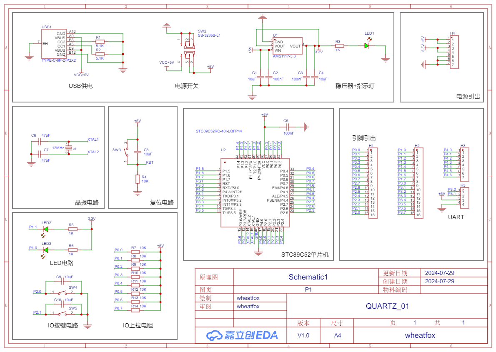

[https://www.bilibili.com/video/BV1At421h7Ui](https://www.bilibili.com/video/BV1At421h7Ui)

# 贴片电阻读法

1. **3位读数**：
   - 前两位为有效数字。
   - 第三位表示10的次幂（也可以理解为0的个数）。
   - 精度为$±5\%$。

2. **4位读数**：
   - 前三位为有效数字。
   - 第四位表示10的次幂（也可以理解为0的个数）。
   - 读法和3位的原理一样，精度为$±1\%$。

3. **阻值小于10的读数**：
   - 通常在两个数字之间插入一个字母“R”，用字母“R”来代替小数点。

# 电容读数

铝电容字母与电压对照

|      | A    | B   | C    | D   | E   | V   | T   |
| ---- | ---- | --- | ---- | --- | --- | --- | --- |
| 电压 | 2.5V | 4V  | 6.3V | 10V | 16V | 20V | 25V | 35V | 50V |

涤纶电容耐压对应表

|      | A    | B     | C    | D    | E    | F     | G    | H    | J    | K    | Y    | Z    |
| ---- | ---- | ----- | ---- | ---- | ---- | ----- | ---- | ---- | ---- | ---- | ---- | ---- |
| 电压 | 1.0V | 1.25V | 1.6V | 2.0V | 2.5V | 3.15V | 4.0V | 5.0V | 6.3V | 8.0V | 8.9V | 9.0V |

# 二极管

## 二极管种类及应用

### 肖特基二极管 (D1)

- **特性**：反向恢复时间极短（可小到几纳秒），正向导通压降仅0.4V左右。
- **应用**：高频、低压、大电流时的整流、续流、保护、检波。

### 变容二极管 (D2)

- **特性**：反向电压增大时结电容减小，反之结电容增大。
- **应用**：高频电路中用于自动调谐、调频、调相等。

### 稳压二极管/齐纳二极管 (D3)

- **特性**：利用pn结反向击穿特性，电流在很大范围内变化而电压基本不变。
- **应用**：稳压器或电压基准元件。

### 普通二极管 (D4)

- **特性**：单向导电，只能从一个方向流过。
- **应用**：整流电路、检波电路、稳压电路、各种调制电路。

### 瞬态电压抑制器 (TVS) 二极管

- **特性**：瞬态电压抑制器是一种耗散高瞬态功率浪涌的半导体器件。
- **应用**：抑制高压尖峰。

### 发光二极管 (LED)

- **特性**：当电子与空穴复合时能辐射出可见光。
- **应用**：照明、平板显示、医疗器件。

# 三极管

## 三极管与场效应管对比

| 项目       | 三极管                    | 场效应管                       |
| ---------- | ------------------------- | ------------------------------ |
| 导电机构   | 既用多子，又用少子        | 只用多子                       |
| 导电方式   | 载流子浓度扩散及电场漂移  | 电场漂移                       |
| 控制方式   | 电流控制                  | 电压控制                       |
| 类型       | PNP/NPN                   | P沟道、N沟道                   |
| 放大参数   | $\beta = 50 - 100$ 或更大 | $G_m = 1 - 6 \, \text{ms}$     |
| 输入电阻   | $10^2 - 10^5 \, \Omega$   | $10^2 - 10^{15} \, \Omega$     |
| 抗辐射能力 | 差                        | 在宇宙射线辐射下，仍然正常工作 |
| 噪声       | 较大                      | 小                             |
| 热稳定性   | 差                        | 好                             |
| 制造工艺   | 较复杂                    | 简单，成本低，便于集成化       |
| 应用电路   | C极与E极一般不可倒置使用  | 有的型号D\S极可倒置使用        |

# 原理图绘制

# PCB布局

## PCB布线要求

1. **顶层优先原则：**  
   尽量在顶层布线。

2. **电源线原则 - 增加加粗：**  
   因为电源线是要给电路板各个模块供电的，电源线加粗有利于电流在主干道上流通。在日常PCB设计中，在25℃时，对于铜厚为10z（35um）的导线，10mil线宽能承载0.65A电流，40mil线宽能承载2.3A电流。

3. **同一层内走线大于90°：**  
   同一层走线禁止90°或直角走线，从原理上讲，锐角直角走线会造成走线阻抗不连续，对于信号的传输有影响，推荐走线135°。

4. **注意电流路径和电容的摆放位置：**  
   电源要先经过电容滤波再给后级，去耦电容要贴近芯片引脚放置，并就近接地。

5. **高频信号线尽可能短，并做好与其他信号的屏蔽隔离：**  
   为了降低相邻走线之间的串扰，尽量避免相邻导线平行走线，走线应遵循3W原则：相邻导信号线应采用正交方向。差分线的走线尽量等距等长。

6. **PCB布线要尽量远离安装孔与电路板边缘：**  
   在PCB钻孔加工中，很容易会切掉一部分导线，为了电路板功能，应尽量远离这些位置。

7. **需要添加泪滴：**  
   增加泪滴以增强焊盘与走线之间的机械强度。

铺铜前：

铺铜后：

顶层底层铺铜主要是方便所有GND网络连接。

最终设计的基于51单片机核心板制作的开发板PCB绘制结果：

# 焊接+测试

用锡膏+热风枪300度焊接元器件，一开始焊完后LED不亮，万用表测了一下电压没问题，那就是LED接反了，重新焊接后三个LED均正常。

测试串口烧录，一开始用stc烧录软件检查芯片+烧录均没反应，后来发现需要先断电然后再给芯片上电才能正常读写芯片数据，然后烧录程序到ROM就没啥问题了，之后可以学一下芯片手册，用KEIL写一些简单的程序跑一跑。

<!--  -->

<video style="border-radius: 15px; overflow: hidden;" width="100%" height="100%" controls>
  <source src="/2024/07/28/microcomputer-learning/quartz_001_01.mp4" type="video/mp4">
</video>

[51单片机之串口通信详解及代码示例](https://blog.csdn.net/didi_ya/article/details/124289688)