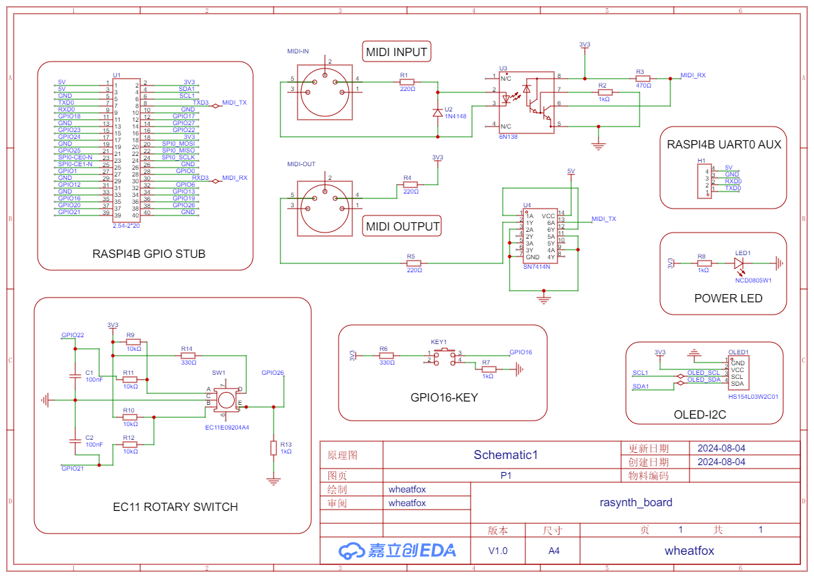
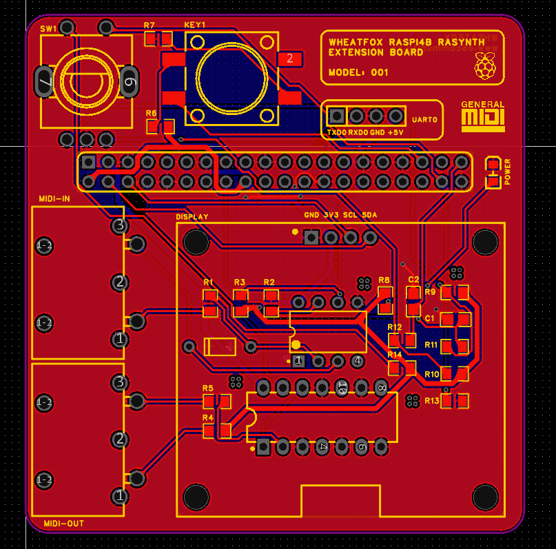
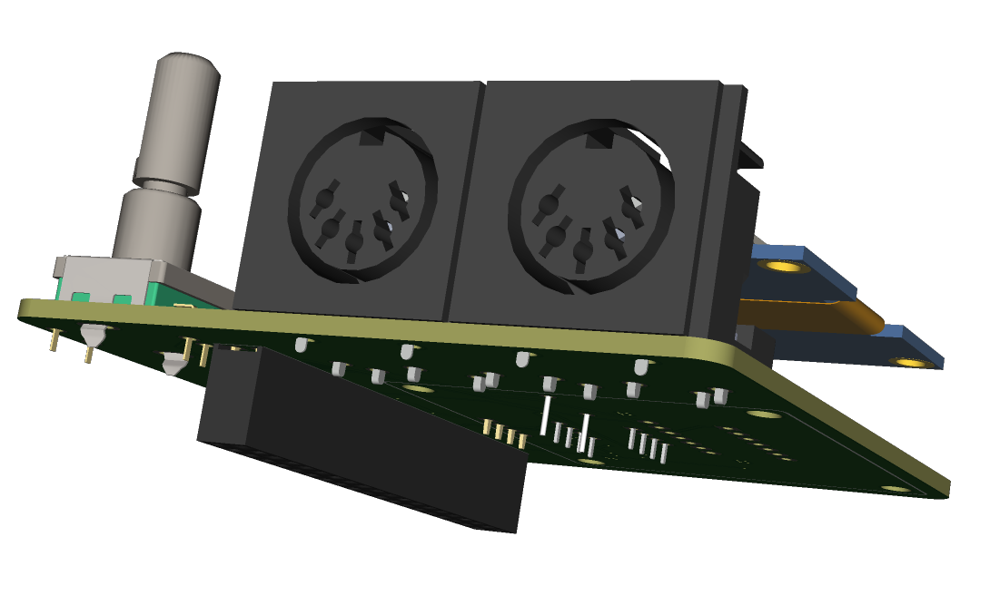
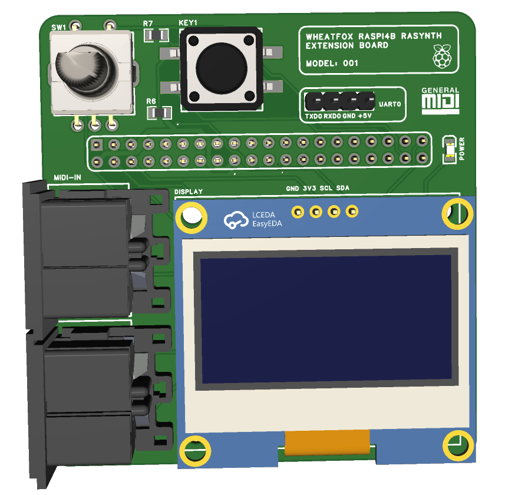
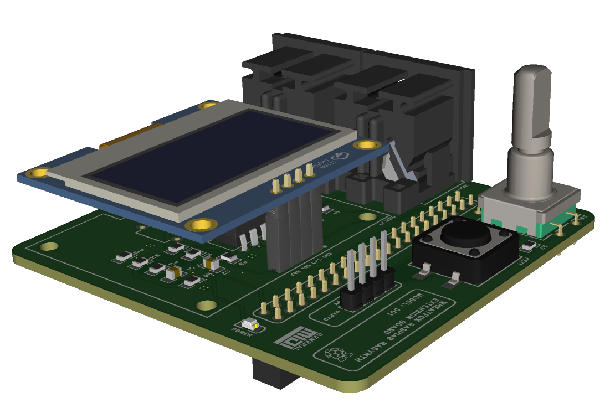
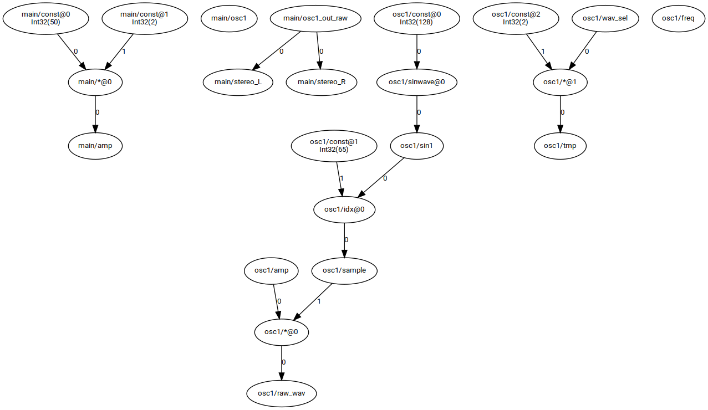

最近又重新捡起了树莓派开始玩，除了想在树莓派上跑通一个类似alexa或siri+homepod这样的智能助手（STT+ChatGLM+TTS，目前已在我的Github仓库开源，实时更新最新进展），我又萌生了希望给树莓派写一个合成器的想法（你还是忘不了你那合成器hh）。

关于智能语音助手的内容，也许我会在之后研究的差不多后再更新一篇博客，不过这次主要还是说一下我给树莓派开发的合成器——Rasynth的进展。

# 整体设计

目前我的想法是通过GPIO拓展板的形式，把MIDI接口、OLED屏幕、旋钮+按钮等进行对接，这就需要自己画一个电路板+画PCB。在硬件完成后，通过软件读取MIDI数据，然后直接通过ALSA输出音频。
拓展板的按钮和旋钮通过GPIO绑定到合成器的操作和导航上，同时通过I2C向屏幕发送渲染信号，绘制UI。

# 硬件设计

电路原理图目前的草稿版本如下：



主要分为：

1. **MIDI IN/OUT**，众所周知MIDI传输实际上还是通过类似**串口**的方式来实现的，5PIN针脚通过光耦和二极管后就可以直接拿到RX信号，而输出则是直接把TX接两个GATE然后接回MIDI OUT 5PIN，由于板子大小的关系，我没有实现MIDI手册参考电路中的MIDI THRU。得到MIDI的TX和RX后，我直接接入了树莓派的TXD3+RXD3引脚，这样就可以通过配置树莓派设备树overlay的方式启用UART(RXD3+TXD3)，只不过这个串口由MIDI传输独占了，在板子linux文件系统的/dev下应该可以出现ttyAMA4串口设备，然后用户软件读写这个设备就能进行MIDI数据传输了（如使用ttyMIDI，以及用python直接处理原始串口MIDI数据，注意baud rate应为31250）。
2. **转子和开关**逻辑，树莓派的GPIO可以有上拉和下拉两个方式来使用（手册中可以查默认是HI还是LOW，对应外部电路是要上拉还是下拉），而转子（实现旋钮选择）则是在两个旋转方向产生各自信号的上升沿的方式来提供信息（不同型号旋转一圈产生的采样数不同，这里可以查EC11手册了解详细信息）。
3. **I2C屏幕**，这里我选了一个I2C协议的OLED屏幕，接入树莓派SPI1相关引脚，注意这里供电是3.3V（对应该型号手册中3-5V的限制）。

由于我买的MIDI 5PIN接口没有在EDA的器件库中，所以这次我也是完整做了一回元件+封装+3D模型的设计和绑定，MIDI 5PIN 3D模型来自[这个3D模型网站](https://www.3dcontentcentral.com/download-model.aspx?catalogid=171&id=725801)。

## PCB布局布线

这次手动布局后，我试了一下立创EDA的自动布线，可以配置布线网络（如暂时忽略GND之后手动铺铜）以及调整每个网络的具体规范（如我给5V和3.3V电源线加粗了一些），然后交给EDA自动布线即可。










# 软件设计

[Rasynth+Raslisp代码](https://github.com/oscommunity/Rasynth)

在软件方面，我目前的计划是做一个像MAX/MSP一样的模块化编程的音频处理逻辑，由于我不打算像MAX那样搞图形化编程，我目前正在设计给Rasynth专用的一个音频处理流描述语言——Raslisp，其整体上和数字电路中verilog的思路很像，包括模块（Box）、算子（Operator）、网点（Node）等，并且我个人采用了偏向lisp的语法形式，但是和verilog一样，Raslisp是并行的，即是对处理流程的结构描述，并不是一个串行顺序执行的编程模型。

Rasynth是面向树莓派4B开发的（毕竟需要GPIO拓展板实现一些功能），而Raslisp作为配套模块化编程语言，其主要负责Rasynth的内部处理逻辑，支持用户使用语言编写自己的处理逻辑，而且能够在更多平台上使用（目前只考虑Debian系Linux如Ubuntu/Debian/Raspiberry Pi OS）。

## Raslisp编译器设计

整个Rasynth+Raslisp使用Rust开发，尽可能保证运行效率。编译器前端使用LALRPOP框架，目前设计的Raslisp语法如下：

```lisp
; test/test.raslisp
(box test1 (
    in in1: float
    out out1: float
)
    (let out1 (+ in1 1))
)
```

```lisp
; test/osc1.raslisp
(box osc1 (
    in freq: float
    in amp: float
    in wav_sel: i32
    out raw_wav: float
)
    (let sin1 (sinwave 128)) ; sin1: waveform
    (let sample (idx sin1 65)) ; get sin1[65]'s sample value
    (let raw_wav (* amp sample))
)

(box main (
    out stereo_L: float
    out stereo_R: float
)
    (let amp (* 50 2))
    [osc1 440 amp 0 osc1_out_raw]
    (let stereo_L osc1_out_raw)
    (let stereo_R osc1_out_raw)
)
```

编写对应的语法文件并让LALRPOP解析：

```rust
use lalrpop_util::lalrpop_mod;
use std::fs;
pub mod ast;

lalrpop_mod!(pub raslisp); // synthesized by LALRPOP

fn main() {
    let test1 = fs::read_to_string("../test/test.raslisp").unwrap();
    let r = raslisp::BoxDefineParser::new().parse(&test1).unwrap();
    println!("{:?}", r);
}

```

```
Box("test1", [In("in1", Float), Out("out1", Float)], [LetDefine(Let("out1", Operator("+", [NodeIdent("in1"), Num(Int32(1))])))])
```

## 2024.8.6 进度

今天开始写从AST到实际数据结构的转换逻辑，AST中的每个port/node/字面量等都对应FlowGraph中的节点，图中的有向边表示数据流动，边上会记录当前流向对应着to节点的第几个参数，例如

```lisp
(let x (+ a 1))
```

```
   a        1
   |        |
[arg0]    [arg1]
   \        /
    \      /
     \    /
      \  /
     +@0
      |
   [arg0]
      |
      x
```

对应为4个节点`x`、`+@0`、`a`、`CONSTANT:1`，其中`a`和`1`出边引向`+@0`，权值分别为arg0和arg1（所有带@的为operator算子，后缀带有一个防重复的编号，在Raslisp中，每个box内为一个命名空间，不同box内的node可以重名），之后`+@0`节点出边arg0到x节点，下面给出一个实例：

```lisp
(box osc1 (
    in freq: float
    in amp: float
    in wav_sel: i32
    out raw_wav: float
)
    (let sin1 (sinwave 128)) ; sin1: waveform
    (let sample (idx sin1 65)) ; get sin1[65]'s sample value
    (let raw_wav (* amp sample))
    (let tmp (* wav_sel 2))
)

(box main (
    out stereo_L: float
    out stereo_R: float
)
    (let amp (* 50 2))
    [osc1 440 amp 0 osc1_out_raw]
    (let stereo_L osc1_out_raw)
    (let stereo_R osc1_out_raw)
)
```


（注：目前暂未实现`[osc1 ...]`这样的box调用接线逻辑）

neovim for rust

https://rsdlt.github.io/posts/rust-nvim-ide-guide-walkthrough-development-debug/